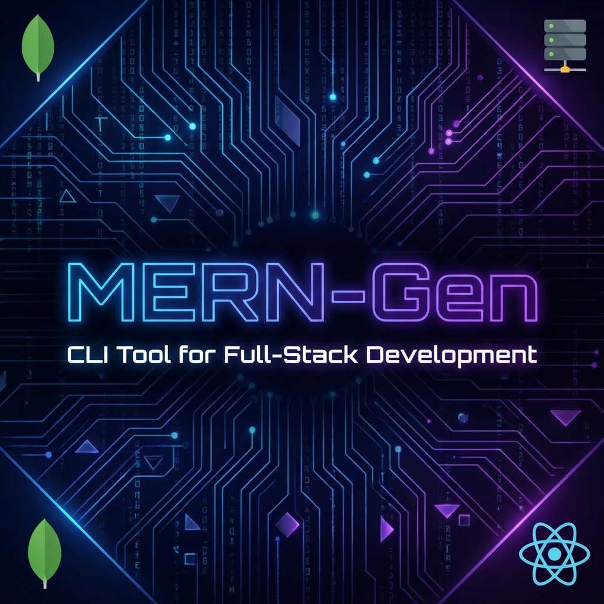
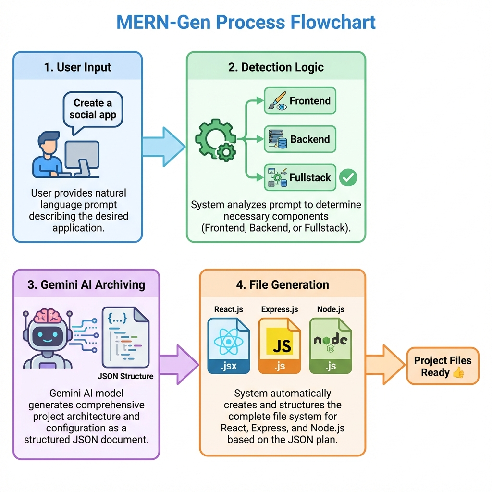
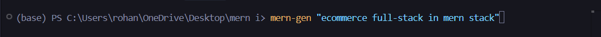
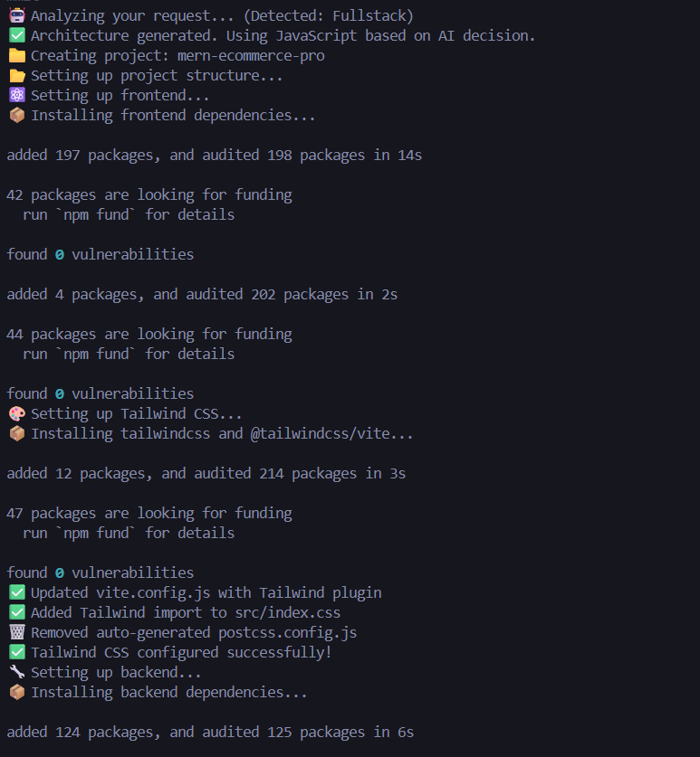
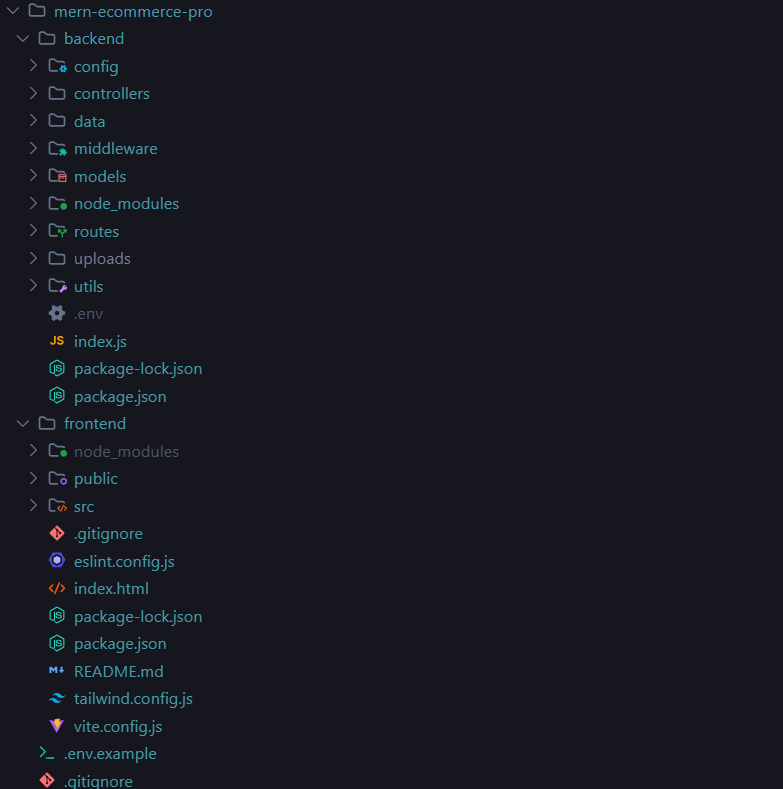
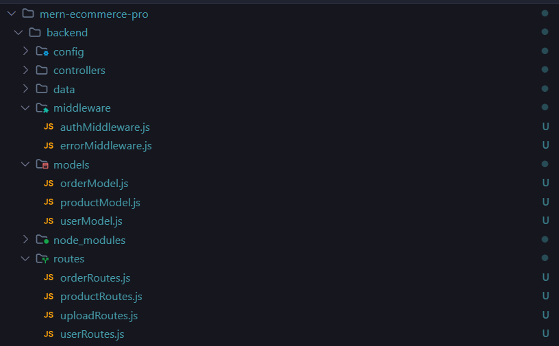

# ⚡ MERN-Gen



**MERN-Gen** is an intelligent, AI-powered CLI tool designed to instantly scaffold full-stack web applications. By leveraging the power of Google's Gemini AI, it interprets natural language prompts to generate production-ready architectures, complete with file structures, dependencies, and configuration files.

Whether you need a simple MERN stack app, a specialized frontend portfolio, or a robust backend API, MERN-Gen automates the setup process, saving you hours of boilerplate coding.

---

## 🚀 Features

- **🤖 AI-Driven Architecture**: Uses Google GenAI (`gemini-1.5-flash` via Proxy) to intelligently decide the project structure.
- **🛡️ Secure Proxy Server**: centralized API handling to keep your Gemini API keys secure and manage request traffic.
- **🧩 Smart Project Detection**: Automatically detects **Frontend-only**, **Backend-only**, or **Fullstack** requirements.
- **🌐 Multi-Framework Support**: React, Vue, Next.js.
- **🔷 TypeScript & JavaScript**: Full support for both languages with auto-detection.
- **🎨 Automated Tailwind CSS**: Zero-config Tailwind setup.
- **📦 Smart Dependency Management**: Auto-installation of packages based on project needs.

---

## 🏗️ Architecture

MERN-Gen operates using a **Client-Server** architecture to decouple the CLI from the AI provider.

1.  **CLI Tool (`/cli`)**: The user interface. It captures your prompt, detects the project type, and sends a request to the local Proxy Server. Once it receives the architecture JSON, it handles file generation, `npm install` processes, and configuration.
2.  **Proxy Server (`/proxy-server`)**: An internal Express server that securely holds your Gemini API Key. It receives the prompt from the CLI, communicates with Google's Gemini API to generate the architecture, and returns the strictly formatted JSON to the CLI.



---

## 🛠️ Installation

You need to set up both the **Proxy Server** (one-time setup) and the **CLI**.

### Prerequisites
- Node.js (v18+)
- Google Gemini API Key

### 1. Setup the Proxy Server
The proxy server must be running for the CLI to work.

```bash
cd proxy-server
npm install
```

Create a `.env` file in `proxy-server/`:
```env
GEMINI_API_KEY=your_actual_api_key_here
PORT=5001
```

Start the server:
```bash
npm run dev
# Server runs on http://localhost:5001
```

### 2. Setup the CLI
Open a new terminal window:

```bash
cd cli
npm install
npm link
```
*`npm link` allows you to runs `mern-gen` globally from anywhere in your terminal.*

---

## 📖 Usage

1.  **Ensure the Proxy Server is running** (Step 1 above).
2.  **Run the CLI** from any directory where you want to create your project:

```bash
mern-gen "Build a social media app with user authentication"
```

### Examples



**Fullstack MERN with TypeScript**
```bash
mern-gen "Create a task management system using MERN stack and TypeScript"
```




**Frontend Portfolio**
```bash
mern-gen "A personal portfolio website using React and Tailwind"
```

**Backend API**
```bash
mern-gen "A REST API for an e-commerce store using Express and MongoDB"
```

---

## 🔧 Technologies Used

- **CLI**: Node.js, libraries (`fs`, `child_process`)
- **Proxy Server**: Express, `@google/genai` SDK
- **AI Model**: Gemini 1.5 Flash (optimized for speed and logic)

---

## 🤝 Contributing

Contributions are welcome! Please feel free to submit a Pull Request.

1. Fork the project
2. Create your feature branch (`git checkout -b feature/AmazingFeature`)
3. Commit your changes (`git commit -m 'Add some AmazingFeature'`)
4. Push to the branch (`git push origin feature/AmazingFeature`)
5. Open a Pull Request

---

## 📄 License

Distributed under the MIT License. See `LICENSE` for more information.
